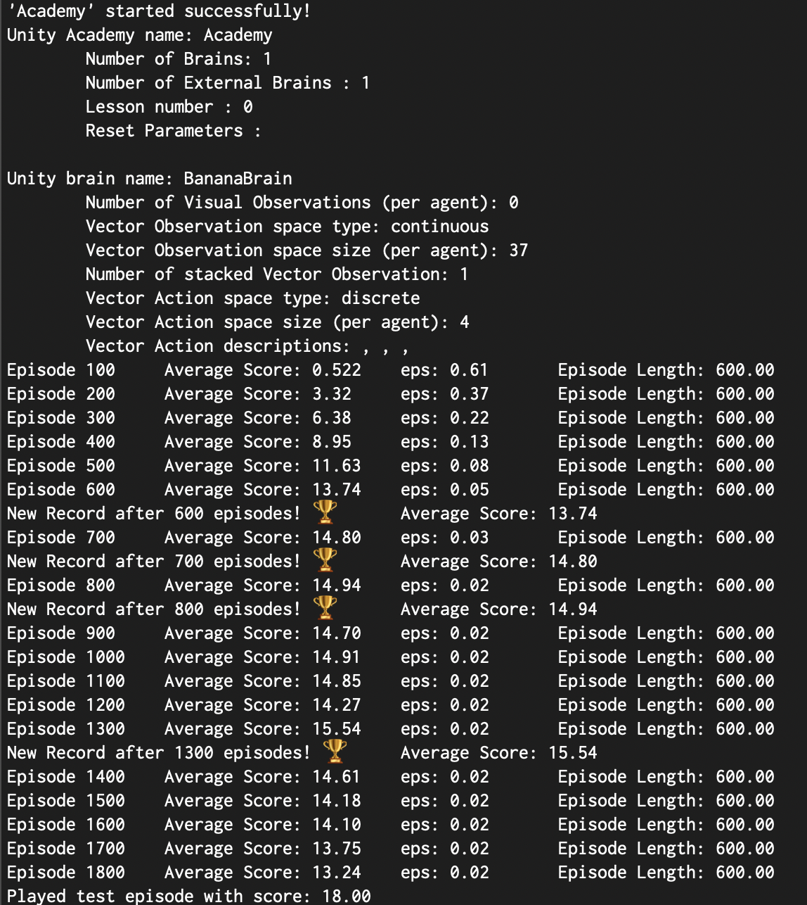
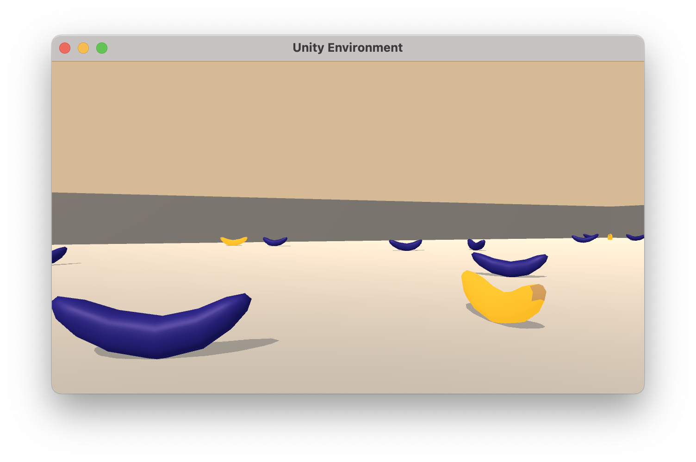

# BananaBrain Project Submission
Code of the Project submission for the DeepRL Udacity Course: Navigation.

The simulation contains a single agent that navigates a large environment.  At each time step, it has four actions at its disposal:
- `0` - walk forward 
- `1` - walk backward
- `2` - turn left
- `3` - turn right

The state space has `37` dimensions and contains the agent's velocity, along with ray-based perception of objects around agent's forward direction.  A reward of `+1` is provided for collecting a yellow banana, and a reward of `-1` is provided for collecting a blue banana. 


The task is episodic, and in order to solve the environment, your agent must get an average score of +13 over 100 consecutive episodes.

## Getting Started

1. Download the environment from one of the links below.  You need only select the environment that matches your operating system:
    - Linux: [click here](https://s3-us-west-1.amazonaws.com/udacity-drlnd/P1/Banana/Banana_Linux.zip)
    - Mac OSX: [click here](https://s3-us-west-1.amazonaws.com/udacity-drlnd/P1/Banana/Banana.app.zip)
    - Windows (32-bit): [click here](https://s3-us-west-1.amazonaws.com/udacity-drlnd/P1/Banana/Banana_Windows_x86.zip)
    - Windows (64-bit): [click here](https://s3-us-west-1.amazonaws.com/udacity-drlnd/P1/Banana/Banana_Windows_x86_64.zip)
    
    (_For Windows users_) Check out [this link](https://support.microsoft.com/en-us/help/827218/how-to-determine-whether-a-computer-is-running-a-32-bit-version-or-64) if you need help with determining if your computer is running a 32-bit version or 64-bit version of the Windows operating system.

    (_For AWS_) If you'd like to train the agent on AWS (and have not [enabled a virtual screen](https://github.com/Unity-Technologies/ml-agents/blob/master/docs/Training-on-Amazon-Web-Service.md)), then please use [this link](https://s3-us-west-1.amazonaws.com/udacity-drlnd/P1/Banana/Banana_Linux_NoVis.zip) to obtain the environment.

2. Place the file in the DRLND GitHub repository, in the `unity/` folder, and unzip (or decompress) the file. 
3. Install the relevant dependencies on your workspace. Please refer to ([this link](https://github.com/udacity/deep-reinforcement-learning#dependencies)) for detailed instructions.
   
   Alternatively, you may want to install the following packages using `pip install`:
   ```bash
   tensorflow==1.7.1
   Pillow>=4.2.1
   matplotlib
   numpy>=1.11.0
   jupyter
   pytest>=3.2.2
   docopt
   pyyaml
   protobuf==3.5.2
   grpcio==1.11.0
   torch==0.4.0
   pandas
   scipy
   ipykernel
   ```

**NB:** The code on this repo has been tested for **MacOS only**. In other operative systems the name of the compiled environment may be differrent and therefore `train_dqn.py` and `run_dqn.py` may require to edit the extension of the unity executable app.
   
# Introduction

In this repo, you can find the code to train and run AI trained though Deep Reinforcement Learning based on the DQN Architecture.
In particular, You'll find implementation of the following variants:
- Basic Agent (for execution only) `Agent`
- Double DQN with Classic Memory Replay `ReplayDDQNAgent`
- Double DQN with Priority Based Memory Replay `PriorityReplayDDQNAgent`

Each those support both the following architectures:
- DQN `DQN`
- Dueling DQN `Dueling_DQN`
  
The problem we are solving in this repo is the `BananaBrain` Game implemented as a Unity virtual environment.
The game consists in collecting as many yellow bananas as possible, while avoiding the blue bananas.
For each yellow banana collected the overall score increases by `+1`, while collecting a blue banana will provide a `-2` score decrease and will terminate the game episode.
The problem will be considered solved once the agent can get an average score over 100 episodes of `13` in less than `1800` episodes. However, since, as you will see in the `Report.md`, that goal is reached very early (episode `400-700`) we'll push the training to a max number of episodes and we will save the agent version that performed the best on that metric. The winning agent will be referred as `trained_model.pth` in the asset folder.

## Repo Organisation
In the root of the folder you can find the following scripts:
```python
train_dqn.py # shapes the training procedure and, if appropriately edited, allows to select the hyperparameters of training and the type of architecture used
run_dqn.py # loads a trained agent and runes an episode of fixed length
```
In the `assets` folder, all the files resulting from the training process can be found:
- `figs` contains the plot figures obtained from the training process
- `models` contains the checkpoints of the trained agents.

In the `unity` folder, the compiled version of the unity enviroment should be placed.

In the `src` folder are located the core components of the models' and agents' code:
```python
model.qnet.py #contains the code of the DQN and Dueling DQN models.
replay_buffers.buffer_replay #contains the code regarding the 2 variants of buffer replay
agents.py #contains the code of the 3 implemented agent variants
environment_utils.py #contains the code that connects to the unity environment and that manages the training and execution of the agent.
```
# How to use the framework

After installing the required dependencies and activating the `drlnd` conda workspace the framework can be used veriy easily.
## **Train**
To train a new agent one has to execute the following command from the root of the repository:
```bash
python3.6 train_dqn.py
```
Once started, the script will launch the Unity environment and will report the scores on the terminal.
The terminal screen will look like this:
<!--  -->


## **Execute**
To run the trained model in a episode of the game, you'll have to run:
```bash
python3.6 run_dqn.py
```
This script will run the agent through an episode of a fixed length (400 steps) and will print the score obtained on screen.



# Agent Training
In this section, one can find out how to edit the training parameters and which have been chosen for this specific problem.
## Training Script
Most training details can be edited in the `train_dqn.py` file.
`LAYERS = [64, 128, 64]` indicates the size (and number) of the hidden layers of the chosen DQN (In this case 3 hidden layers of respectfully 64, 128 and 64 neurons).
`out_file = 'trained_model.pth'` indicates the name of the file used for the checkpoint and the plot figure file.

Most of the training hyperparameters are decided here:
```python
 training_manager.dqn_train(
        n_episodes=1800, max_t=400,
        eps_start=1, eps_end=0.02, eps_decay=0.9950,
        target_score=13., out_file=checkpoint_path)
``` 
In which sets the max number of episodes `n_episodes`, maximum length of the episode `max_t`, value of epsilon at the start of the training `eps_start`, the minimum value of epsilon `eps_end`, the epsilon decay factor per episode `eps_decay`, the training target score (the checkpoint will be saved at scores higher than this) `target_score` and the path of the checkpoint file to save `outfile`.

An Additional set of hyper-parameters define the behaviour and the learning of the agent. Those can be included in the `kwargs` of the Agent class and are the following:
### For all the Agents Categories
```python
dueling # (boolean) if True uses a Dueling DQN architecture if False a simple DQN
```
### Exclusive to (ReplayDDQNAgent, PriorityReplayDDQNAgent)
```python
lr # learning rate of the neural network
batch_size # size of the batch used for training the network
gamma # discount factor used for the Agent Learning
update_every # defines after how many steps the network should be updated
buffer_size # size of the memory for the Memory Replay
tau # coefficient of (linear) interpolation between the local and target networks (used in the DDQN soft_update)
```
### Exclusive to (PriorityReplayDDQNAgent)
```python
priority_probability_a # Coefficient used to compute the importance of the priority weights during buffer sampling
priority_correction_b # Corrective factor for the loss in case of Priority Replay Buffer
```

For example the agent can be instantiated with:
```python
    agent = PriorityReplayDDQNAgent(
        states_dim, action_dim, hidden_layers=LAYERS,
        update_every=4,
        lr=5e-4, # learning rate
        batch_size=64,
        buffer_size=int(1e5),
        dueling=True, # using Dueling DQN
        gamma=0.99, #discount factor
        tau=1e-3, # for soft update of target parameters
        priority_probability_a=.9, # Coefficient used to compute the importance of the priority weights during buffer sampling
        priority_correction_b=.9 # Corrective factor for the loss in case of Priority Replay Buffer
        )
```