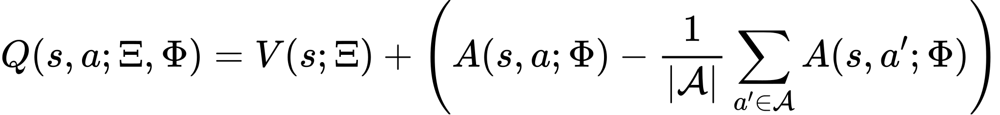

# Report BananaBrain Submission

## **Model Description**
The code in this repository implements processes to train and execute autonomous agents to navigate in the BananaBrain Unity environment.
The code makes available 3 classes for agents (`Agent`, `ReplayDDQNAgent`, `PriorityReplayDDQNAgent`) using 2 different types of Neural Network (`DQN`, `Dueling_DQN`). Thus, it implements the following Deep Reinforcement Mechanisms:

- `DQN` is an approach to train agents using reinforcement learning using a Neural Network. It is used to estimate the `Q(s,a)` advantage of using a certain action `a` in a specific state `s`. The neural network is trained using the following loss.<div align="center"></div> in which:
    - <code>γ</code> is the discount factor determining the agent’s horizon;
    - <code>Θᵢ</code> are the parameters of the Q-network at iteration i;
    - <code>Θ⁻ᵢ</code> are the network parameters used to compute the target at iteration i;
    - <code>D</code> is the dataset <code>D = {e₁, e₂, ..., eₜ}</code> and <code>eₖ = (sₖ, aₖ, rₖ, sₖ₊₁)</code>
    - <code>r</code> is the reward
    - The target network parameters <code>Θ⁻ᵢ</code> are only updated with the Q-network parameters <code>Θᵢ</code> every <code>C</code> steps and are held fixed between individual updates.
    <!-- $$ 
    L_i(\Theta_i) = \mathbb{E}_{s,a,r,s' \sim \mathbb{U}(D)} [(r + \gamma\max_{a'}Q(s,a';Θ_i^{-}) - Q(s,a; Θ_i))^2]
    $$ --> 
    In practice however, as a single network is used, the target are computed with the following following formula:
    <!-- $
    r_{t+1} + γQ(S_{t+1}, \underset{a} {\mathrm{argmax}} Q(s_{t+1},a;Θ_i);Θ_i)
    $ -->
    <div align="center"></div>
    Which often results in overoptimistic values.

- `Double DQN (DDQN)` is a modification of the DQN trained agents in which the target and local network parameters of the formula above are extrapolated by 2 separate networks occasionally synchornized when perfoming the learning phase. Using a single network for considering both parameters causes an overoptimistic estimation of the Q function. 

    In this case the target are computed as following:

    <!-- $ r_{t+1} + γQ(S_{t+1}, \underset{a} {\mathrm{argmax}} Q(s_{t+1},a;Θ_i);Θ^{-}_i) $ -->
    <div align="center"></div>
    The idea of Double Q-learning is to reduce overestimations by decomposing the max operation in the target into action selection and action evaluation. The network are often synchornized softly using linear interpolation (like in this repo).
    <!-- $$
    Θ^{-}_i = τ × Θ_i + (1 - τ) × Θ^{-}_i
    $$ --> 
    <div align="center"></div>

- `Memory Replay` is a mechanism to make sure that the agent doesn't become overbiased by learning only the actions to the most commonly occurring states. To overcome this problem, the agent won't learn anymore from states and actions as they occur, but rather by sampling experience from stored a stored buffer. In the basic version the sampling occurres through a uniform distribution. However that can be improved with some edits.
  
- `Priority Memory Replay` is an extension of the previously mentioned memory replay mechanism in which the experience sampling does not uccur uniformly but rather giving priority to experience tuples giving higher amount of information. indeed, the probability of being sampled will be dependant on the TD-error:
  <!-- $$
  p_i = |r + \gamma~\underset{a} {\mathrm{argmax}}~Q(s,a';Θ_i^{-}) - Q(s,a; Θ_i)| 
  $$ --> 
  
  <div align="center"></div>
  The probability of sampling the experience with index `j` will be then:
  <!-- $$
  P(j) = \frac{p_j^\alpha}{\sum_k{p_k^\alpha}}
  $$ --> 
  <div align="center"></div>
  with α ∈ [0,1] determining how much prioritization is used. With α = 0 the sampling would be uniform.

  Introducing a non-uniform sampling requires a multiplicative corrective factor wⱼ in calculating the targets:
  <!-- $$
  w_j = \frac{(N \cdot P(j))^{-\beta}}{\underset{i} {\mathrm{max}}~w_i}
  $$ --> 
  <div align="center"></div>
  if β = 1 fully compensates for the non-uniform sampling probabilities P(i). In practice, β is typically annealed from its initial value β₀ to 1. Note that the choice of this hyperparameter interacts with choice of prioritization exponent α; increasing both simultaneously prioritizes sampling more aggressively at the same time as correcting for it more strongly.

- `Dueling Neural Network` This approach proposes to separate the DQN network in 2 sub-networks that estimate the two components of Q(s,a) = V(s) + A(s, a).
  In practice, however, to address an identifiability issue, we can force the advantage function estimator to have zero advantage at the chosen action as following:
  <!-- $$
  Q(s,a;\Xi,\Phi) = V(s; \Xi) + \left(A(s,a;\Phi) - \frac{1}{|\mathcal{A}|}\sum_{a'\in\mathcal{A}}A(s,a';\Phi)\right)
  $$ --> 
  <div align="center" style="background: white;"></div>
  Where Ξ and Φ correspond to the parameters of the A and V subnetworks.

For additional details please refer to the original articles of this methods:

[DQN](https://storage.googleapis.com/deepmind-media/dqn/DQNNaturePaper.pdf), [Double DQN](https://arxiv.org/abs/1509.06461), [Dueling DQN](https://arxiv.org/abs/1511.06581), [Priority Replay](https://arxiv.org/abs/1511.05952)

## **Model Hyper-Parameters**

Here are reported a series of hyper-parameters of the Learning Algorithm:
The input layer size corresponds to the state vector (`37`).
The output layer size corresponds to the number of actions available (`4`).
The network used in this experiment has 3 fully connected hidden layers of respectfully [64, 128, 64] neurons followed by Relu Non-linearities.
In previous attempts, an architecture with 2 hidden layers of [64, 64] neurons, but its convergence was slower.

Regarding the Learning process, the model hyper-parameters are the following
```python
update_every=4,
lr=5e-4, # learning rate
batch_size=64,
buffer_size=int(1e5),
gamma=0.99, #discount factor
tau=1e-3, # for soft update of target parameters (DDQN)
priority_probability_a=.9, # Coefficient used to compute the importance of the priority weights during buffer sampling
priority_correction_b=1. # Corrective factor for the loss in case of Priority Replay Buffer

n_episodes=1800
max_t=600,
eps_start=1.,
eps_end=0.02,
eps_decay=0.9950,
```
For the semantics of the value, please refer to the Readme.md file

## **Training Performance**
The Final approach used all the above mentioned mechanisms reaching a final average score superior to 15. Here are reported an animated GIF captured during the training process and the plot of the average score (100 episodes) during each episode:


## **Example Run**
In here is reported a GIF of an example execution of the trained agent.


## **Future Improvements**

The agents performs already quite well during the game. However, its average score seems to saturate between 15 and 16. Thus it is still improvable. In particularm the following misbehaviours have been found.
1. In certain situations, the agent seems looping without knowing how to proceed, wasting precious steps until the end of the episode.  
2. When a yellow and a blue banana are very close to each other the agents approaches losing the game.


In the case of (1.) one could think to evaluate differt variations of the reward function. For example, introducing mechanisms to make the agent more efficient in its decisions like lowering the reward based on the number of steps between consecutive positive rewards. Such mechanism should be used very carefully, because if the penalty is too high the agent may prefer to take a blue banana nearby rather than a far away yellow banana.
Similarly, for reducing (2.) the negative reward for getting a blue banana could be amplified to avoid selecting yellow bananas close to blue ones.

Furthermore, annealing the values of α and β of the priorty sampling could speedup the convergence.
More importantly, the agent should be trained on the image data from the environment, which may make the agent play with the same baseline as a human would.

